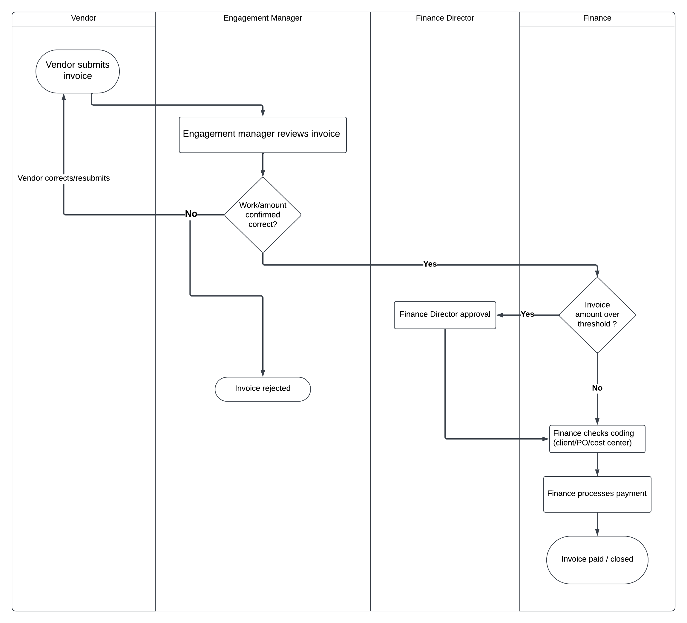
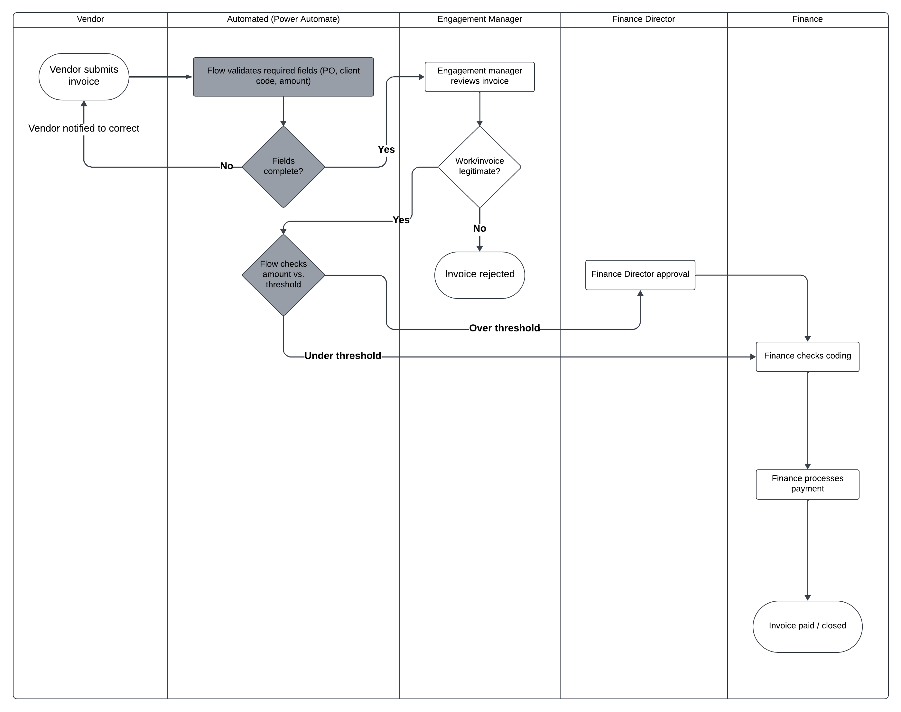
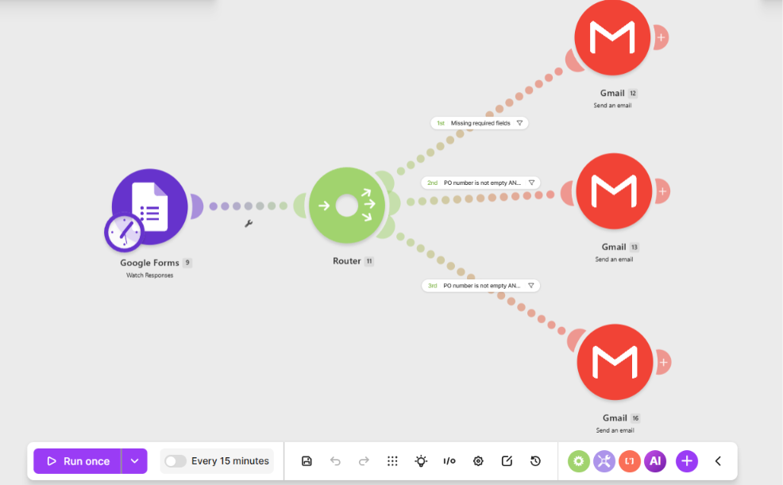
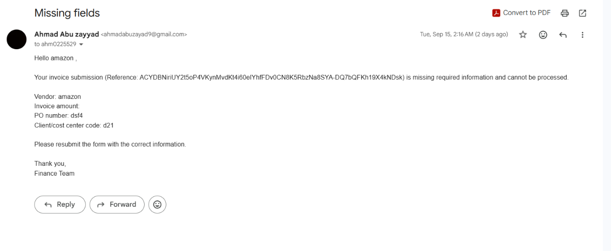

# Vendor Invoice Approval (Process Automation Case Study)

A business analysis project: mapping a manual approval process, quantifying its cost against industry benchmarks, and building a working automation prototype to fix its biggest bottlenecks.

## The problem

Manual vendor invoice approval is a common source of hidden operational cost. not because any single step is hard, but because of small, repeated friction: missing PO numbers, invoices waiting on the wrong approver, and handoffs nobody owns end-to-end.

Published accounts-payable research puts real numbers on this: processing a single invoice without automation costs $12.88 on average and takes 17.4 days end-to-end, compared to $2-3 and 3.1 days for best-in-class, automated AP teams (Ardent Partners, AP Metrics That Matter, 2025).
source: https://invoicequickly.com/stats/invoicing-statistics

## Current-state process

The existing manual process, mapped as a cross-functional (swimlane) flowchart across four roles: Vendor, Engagement Manager, Finance Director, and Finance

Key pain points:
- Missing/incorrect fields (PO number, cost center) aren't caught until a human reviews the invoice, causing rework and delay
- Routing to the right approver based on invoice amount is a manual decision, not a system rule
- No automated notification loop; vendors and approvers rely on manual follow-up

## Future-state process

The redesigned process introduces a dedicated automated lane that handles field validation and amount-based routing, while keeping every real judgment call (is this legitimate, should this be approved) human:

## Benchmarks & impact

| Metric | Manual (typical) | Best-in-class (automated) | Change |
|---|---|---|---|
| Cost per invoice | $12.88 | ~$2–3 | ~80% lower |
| Cycle time (receipt to payment) | 17.4 days | 3.1 days | ~82% faster |

*Source: Ardent Partners, AP Metrics That Matter, 2025 ([via InvoiceQuickly](https://invoicequickly.com/stats/invoicing-statistics))*

**Applied to this project:** scaling these figures to a hypothetical ~40 invoices/month, manual processing costs roughly $515/month in this scenario, automation at a similar rate to best-in-class benchmarks could bring that down toward ~$100/month. This is an illustrative estimate based on the process mapped above, not a separately sourced benchmark.

**Result: cost and cycle time both fall by roughly 80%**, consistent with published best-in-class AP automation benchmarks.

## Automation prototype

Rather than a diagram of what automation *could* do, this project includes a working proof-of-concept built to prove the routing logic actually functions:

- **Trigger:** Google Form submission (simulating the invoice intake form)
- **Logic:** a router with three conditional paths 
  1. Missing required field -> automatic email back to the vendor
  2. Complete + over approval threshold -> routed to Finance Director for approval
  3. Complete + under threshold -> routed directly to Finance for payment
- Each notification email pulls the real submitted data (vendor, amount, PO number, cost center code) rather than a generic message

*Note: the prototype was designed around Microsoft Power Automate as the target platform (standard in Microsoft 365 environments) but built and tested in Make.com due to Power Automate's organizational-account licensing requirement. The routing logic is directly portable between the two.*

## What this demonstrates

- Process mapping and cross-functional flowcharting
- Grounding a business case in real, cited industry data rather than assumptions
- Translating a business requirement into an automated, testable solution
- Debugging and validating a real (not theoretical) automation build
